# CS-From-Zero 🚀

A comprehensive, interactive educational platform for learning **Computer Science fundamentals from scratch**. Built with modern web technologies, this project provides structured curriculum covering 10 modules across all major CS domains.

> **"From zeros and ones to full-stack systems"** — A journey through the foundations of computer science.

## 📋 Table of Contents

- [Overview](#overview)
- [Features](#features)
- [Project Architecture](#project-architecture)
- [Tech Stack](#tech-stack)
- [Curriculum Structure](#curriculum-structure)
- [Getting Started](#getting-started)
- [Project Structure](#project-structure)
- [Development](#development)
- [Contributing](#contributing)

---

## Overview

CS-From-Zero is an interactive learning platform designed for students and professionals who want to understand computer science fundamentals. The curriculum progresses logically from basic digital logic through to advanced topics like databases and networking.

### Key Characteristics
- 📚 **10 Comprehensive Modules** covering all CS fundamentals
- 🎯 **Structured Curriculum** with prerequisites tracking
- 🚀 **Interactive Learning** with visual components and quizzes
- 📱 **Responsive Design** built with Tailwind CSS
- ⚡ **Fast Performance** powered by Vite
- 🎨 **Rich Content** using MDX for flexible content creation

---

## Features

✨ **Core Features:**
- Interactive lessons with multiple topics per module
- Progress tracking for students
- Prerequisite management system
- Visual learning components (diagrams, flowcharts)
- Code examples and quizzes
- Responsive UI for desktop and tablet
- Fast hot module replacement during development
- TypeScript for type safety

---

## Project Architecture

### High-Level System Architecture

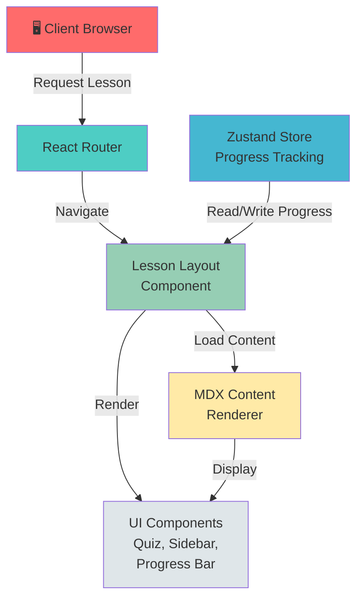

### Data Flow Architecture

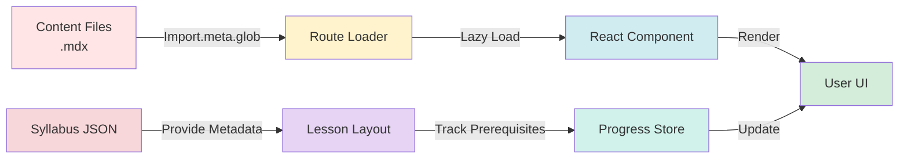

---

## Tech Stack

### Frontend Technologies

```mermaid
graph TB
    subgraph Core["Core Framework"]
        React["⚛️ React 18.3"]
        TS["📘 TypeScript 5.6"]
        Router["🔀 React Router 7.14"]
    end
    
    subgraph Build["Build & Dev"]
        Vite["⚡ Vite 5.4"]
        ESLint["🔍 ESLint 9.13"]
    end
    
    subgraph Content["Content Processing"]
        MDX["📝 @mdx-js 3.1"]
        Remark["💬 Remark GFM"]
        Rehype["🎨 Rehype Highlight"]
    end
    
    subgraph Styling["Styling"]
        Tailwind["🎨 Tailwind CSS 3.4"]
        PostCSS["🔧 PostCSS 8.5"]
        AutoPrefix["📦 Autoprefixer"]
    end
    
    subgraph State["State Management"]
        Zustand["🏪 Zustand 5.0"]
    end
    
    Build -.-> Core
    Core -.-> Content
    Core -.-> Styling
    Core -.-> State
    
    style React fill:#61dafb
    style TS fill:#3178c6
    style Vite fill:#646cff
    style Tailwind fill:#06b6d4
    style Zustand fill:#333333
```

---

## Curriculum Structure

### 10-Module Learning Path

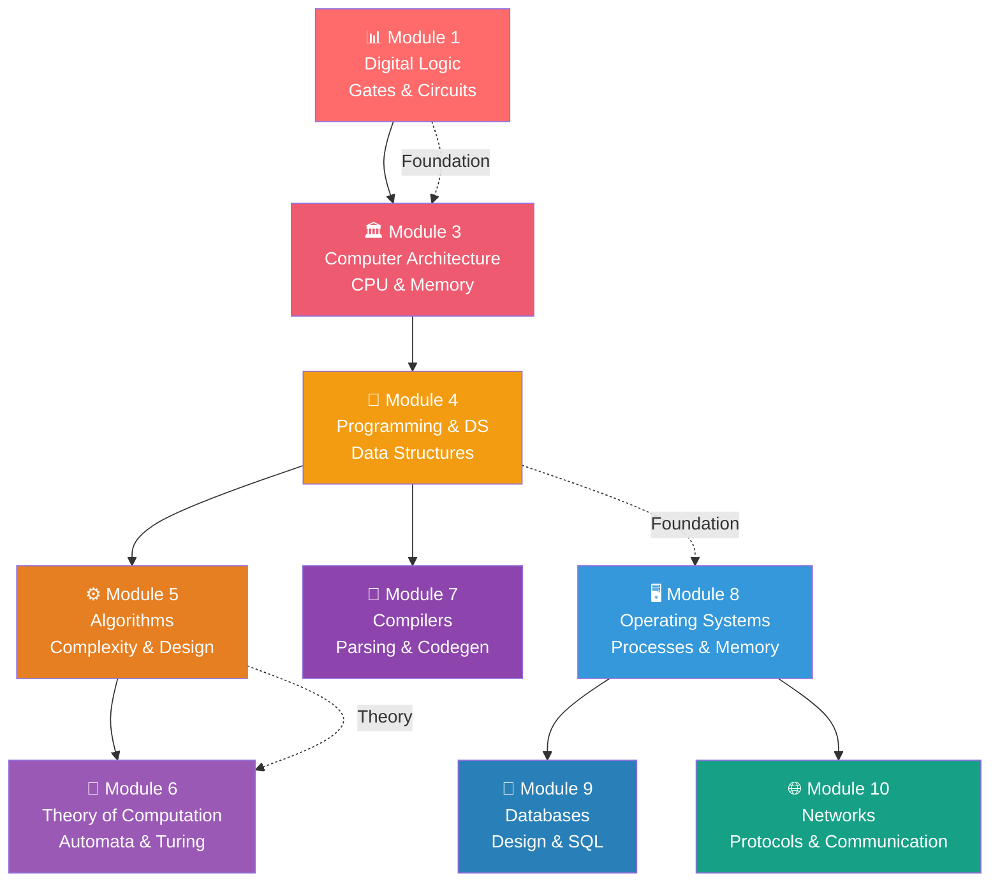

### Module 1: Digital Logic — The Physics of Code

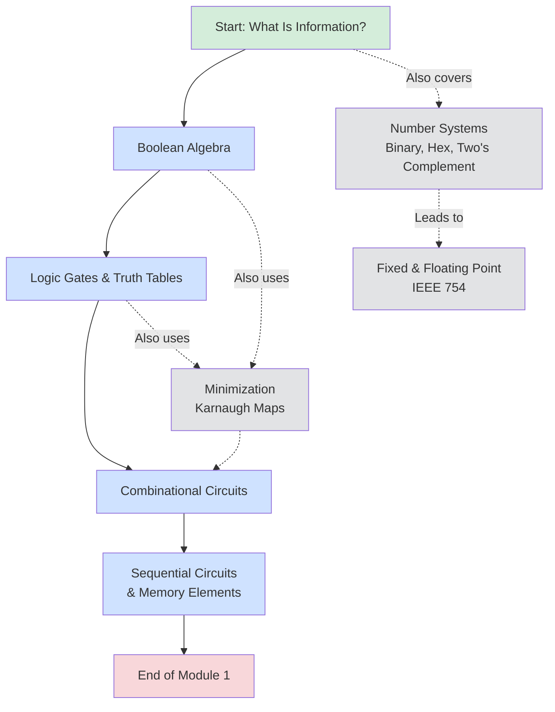

### Module 3: Computer Architecture

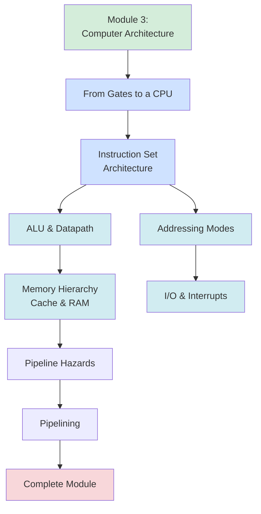

### Module 4: Programming & Data Structures

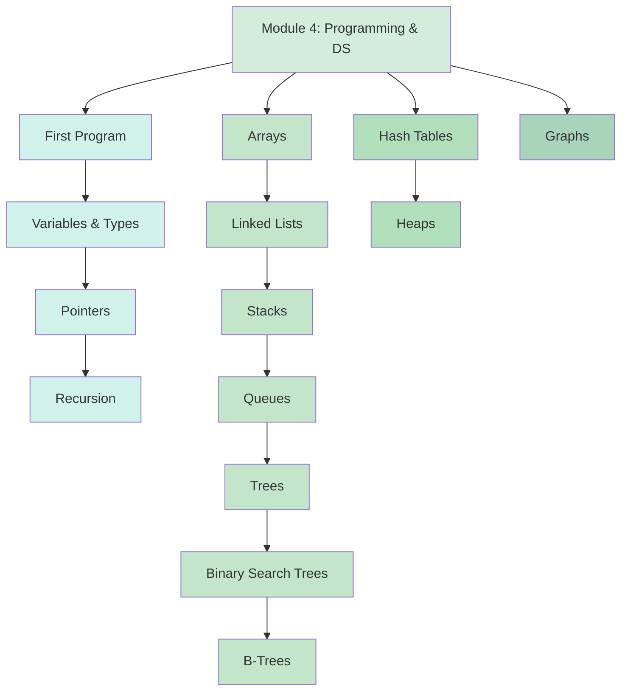

---

## Getting Started

### Prerequisites

- **Node.js** (v16 or higher)
- **npm** or **yarn**

### Installation

1. **Clone the repository**
   ```bash
   git clone https://github.com/yourusername/CS-From-Zero.git
   cd CS-From-Zero
   ```

2. **Install dependencies**
   ```bash
   npm install
   ```

3. **Start the development server**
   ```bash
   npm run dev
   ```

4. **Open in browser**
   - Navigate to `http://localhost:5173`
   - The app will automatically open the first lesson

### Build for Production

```bash
npm run build
npm run preview
```

### Available Scripts

| Command | Description |
|---------|-------------|
| `npm run dev` | Start development server with HMR |
| `npm run build` | Build for production (TypeScript + Vite) |
| `npm run lint` | Run ESLint checks |
| `npm run preview` | Preview production build locally |

---

## Project Structure

### Directory Organization

```
CS-From-Zero/
├── 📄 README.md                    # This file
├── 📄 package.json                 # Dependencies and scripts
├── 🔧 tsconfig.json                # TypeScript configuration
├── 🔧 tailwind.config.js           # Tailwind CSS setup
├── 🔧 postcss.config.js            # PostCSS configuration
├── 🔧 vite.config.ts               # Vite build configuration
├── 🔧 eslint.config.js             # ESLint rules
│
├── 📁 src/
│   ├── 📄 main.tsx                 # App entry point
│   ├── 📄 index.css                # Global styles
│   ├── 📄 mdx-components.tsx       # MDX custom components
│   ├── 📄 vite-env.d.ts            # Vite type declarations
│   │
│   ├── 📁 components/              # React components
│   │   ├── ConceptLink.tsx         # Links to related concepts
│   │   ├── LessonLayout.tsx        # Main lesson container
│   │   ├── PrerequisiteBadge.tsx   # Prerequisite display
│   │   ├── ProgressBar.tsx         # Progress indicator
│   │   ├── Quiz.tsx                # Interactive quizzes
│   │   └── Sidebar.tsx             # Navigation sidebar
│   │
│   ├── 📁 content/                 # Educational content (MDX)
│   │   ├── 📁 module-1-digital-logic/
│   │   │   ├── boolean-algebra.mdx
│   │   │   ├── logic-gates.mdx
│   │   │   ├── number-systems.mdx
│   │   │   └── ... (more lessons)
│   │   ├── 📁 module-3-architecture/
│   │   ├── 📁 module-4-prog-ds/
│   │   ├── 📁 module-5-algorithms/
│   │   ├── 📁 module-6-theory/
│   │   ├── 📁 module-7-compilers/
│   │   ├── 📁 module-8-os/
│   │   ├── 📁 module-9-dbms/
│   │   └── 📁 module-10-networks/
│   │
│   ├── 📁 data/                    # Static data
│   │   └── syllabus.json           # Curriculum metadata
│   │
│   ├── 📁 router/                  # Routing configuration
│   │   └── index.tsx               # Route definitions
│   │
│   ├── 📁 store/                   # State management
│   │   └── progressStore.ts        # Zustand progress store
│   │
│   └── 📁 assets/                  # Images and media
│
└── 📁 public/                      # Static assets
```

### File Relationships

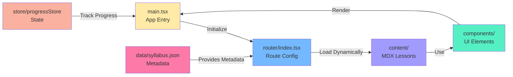

---

## Development

### Understanding the Content System

The content management uses **Vite's `import.meta.glob`** with lazy loading:

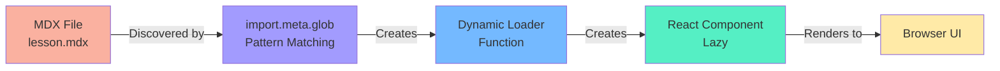

### Component Communication Flow

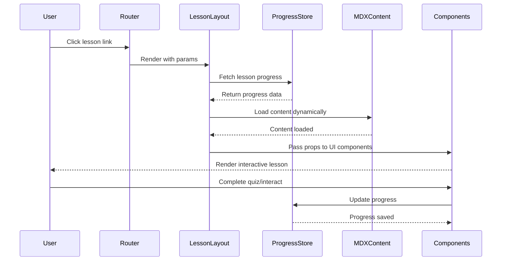

### Adding New Content

1. **Create MDX file** in appropriate module folder
   ```bash
   src/content/module-1-digital-logic/new-topic.mdx
   ```

2. **Update syllabus.json** with lesson metadata
   ```json
   {
     "id": "digital-logic/new-topic",
     "title": "New Topic Title",
     "summary": "Brief description",
     "moduleNumber": 1,
     "prerequisites": ["digital-logic/previous-topic"],
     "estimatedMinutes": 10
   }
   ```

3. **Use custom MDX components** in content
   - Use `<Quiz>` for interactive quizzes
   - Use `<ConceptLink>` for cross-references
   - Use `<PrerequisiteBadge>` to show prerequisites

### Component Overview

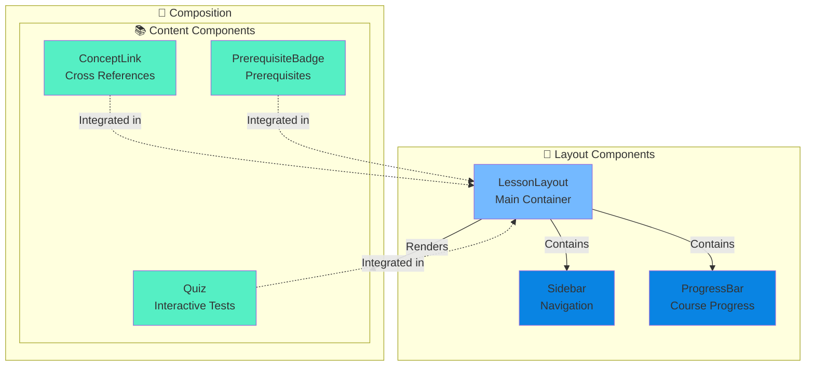

### Build Process

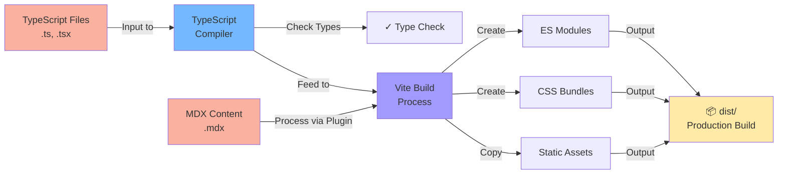

---

## Curriculum Details

### Module Overview Table

| Module | Focus | Topics | Lessons |
|--------|-------|--------|---------|
| **1** | Digital Logic | Gates, circuits, number systems | 10 lessons |
| **3** | Architecture | CPU design, memory, pipelining | 8 lessons |
| **4** | Programming & DS | Data structures, algorithms basics | 14 lessons |
| **5** | Algorithms | Complexity, design paradigms | 11 lessons |
| **6** | Theory | Automata, complexity, decidability | 7 lessons |
| **7** | Compilers | Parsing, code generation | 7 lessons |
| **8** | Operating Systems | Processes, memory management | TBD |
| **9** | Databases | Design, normalization, SQL | TBD |
| **10** | Networks | Protocols, TCP/IP, layers | 9 lessons |

### Learning Path Visualization

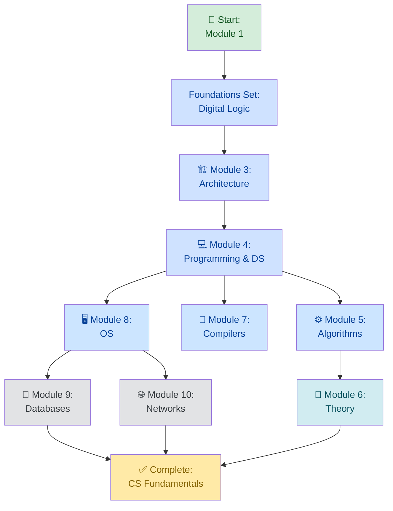

---

## Contributing

We welcome contributions! Please follow these guidelines:

1. **Fork the repository**
2. **Create a feature branch** (`git checkout -b feature/AmazingFeature`)
3. **Commit your changes** (`git commit -m 'Add some AmazingFeature'`)
4. **Push to the branch** (`git push origin feature/AmazingFeature`)
5. **Open a Pull Request**

### Contribution Types
- 📝 **New Lessons**: Add MDX content to appropriate module
- 🐛 **Bug Fixes**: Fix issues in components or build process
- 🎨 **UI/UX**: Improve visual design and user experience
- 📚 **Documentation**: Improve README, add comments
- 🧪 **Testing**: Add tests for components and utilities

---

## Architecture Decision Records

### Why Vite?
- ⚡ Fast development server with HMR
- 📦 Optimized production build
- 🔌 Excellent plugin ecosystem

### Why MDX?
- 📝 Write content in Markdown with React components
- 🎨 Rich interactive lessons without backend
- 🚀 Static site generation friendly

### Why Zustand?
- 🪶 Lightweight state management
- 🎯 Simple API for progress tracking
- 💾 Easy persistence to localStorage

---

## Performance & Optimization

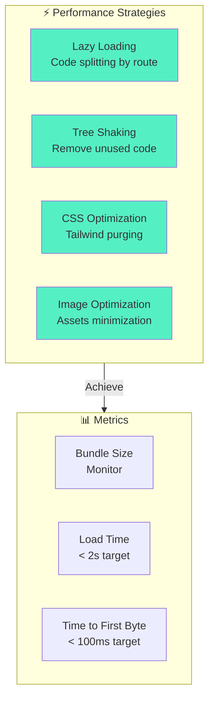

---

## Roadmap

- [ ] Module 2: (Currently skipped in numbering)
- [ ] Complete Module 8: Operating Systems
- [ ] Complete Module 9: Databases
- [ ] Add interactive coding exercises
- [ ] Implement user accounts and cloud sync
- [ ] Add AI-powered Q&A
- [ ] Mobile app version
- [ ] Multilingual support

---

## License

This project is licensed under the MIT License - see the LICENSE file for details.

---

## Support & Contact

- 📧 Email: support@example.com
- 💬 Discord: [Join our community](#)
- 🐛 Issues: [GitHub Issues](https://github.com/yourusername/CS-From-Zero/issues)
- 💡 Discussions: [GitHub Discussions](https://github.com/yourusername/CS-From-Zero/discussions)

---

## Acknowledgments

- 🎓 Inspired by CS50 and other foundational CS courses
- 🙏 Thanks to all contributors and learners
- 📚 Built on top of amazing open-source projects

---

**Happy Learning! 🚀**
